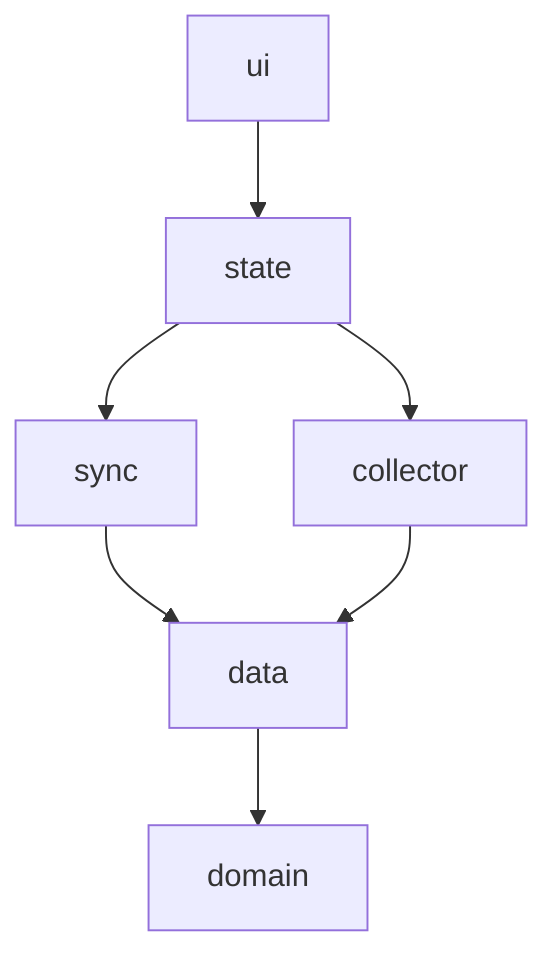

# Lupira Assistant — App backbone

**Status:** design, present-state. The app exists and runs (auth, device registration, location ingest); this doc defines how it grows into the assistant's surface across P0 and P1. Scope here = the **mobile client**; the hub it talks to is `../LupiraAssistantApi/docs/assistant-backbone.md`.

**Reads with:** the product brief (`docs/product-brief.md`) for intent, and the hub backbone (`../LupiraAssistantApi/docs/assistant-backbone.md`) for the contract it consumes. The substrate backbones (`LupiraCalApi`, `LupiraTasksApi`, `GptApi`) matter only as the hub's downstream — the app never touches them directly.

## Purpose & role
The app is the **user-facing surface** — the only surface Daniel touches; everything else is invisible plumbing. It is a **thin client**: no LLM, no agent logic, no voice, no chat thread. It renders the assistant's proposals, questions, and digests, and relays a tap or a short answer back — proactive **propose→confirm**, never an open-ended query. All reasoning lives in assistant-api; the app never calls the gateway.

It grows in two phases:
- **P0 — background substrate + a read-only window.** It signs the user in, registers the device, runs the store-and-forward location stream, and establishes the on-behalf-of grant. It shows a **read-only Inbox** of the assistant's queue. The confirm loop — Approve/Edit/Dismiss, answering questions — rides the **Telegram bot** (the hub's P0 confirm channel), not the app.
- **P1 — the canonical surface.** The Inbox becomes interactive, native push arrives, and connectors/preferences are managed in-app. This retires Telegram as the primary confirm channel (it stays an optional one).

## Foundation it reuses
The app is already built on the primitives the new surfaces need; they **extend** these, nothing is reinvented.

- **Layered architecture**, downward-only, enforced by `eslint-plugin-boundaries` v6 ([eslint.config.mjs](../eslint.config.mjs)). The spine: `domain → data → {collector, sync} → state → ui`, with cross-cutting leaves (`config`, `debug`, `feedback`, `polyfills`) importable by anyone but importing no app layer. `collector` (headless background tasks) and `sync` may **not** reach `state`/`ui`; the sync-status store lives inside `sync/`, so `sync` never imports `state`.

- **Auth** — Authentik OIDC public PKCE (`expo-auth-session`), client `lupira-assistant`, tokens in SecureStore, on-demand refresh with single-flight dedup and a definitive-vs-transient split ([src/data/auth/oidc.ts](../src/data/auth/oidc.ts), [src/state/auth-store.ts](../src/state/auth-store.ts)). The data layer reaches the live token through auth-ports, never importing `state`.
- **Device identity** — registration mints a location-api `DeviceKey` (`Authorization: DeviceKey {apiKey}`), SecureStore-only ([src/data/api/registration.ts](../src/data/api/registration.ts)). This is the **ingest** credential; assistant-api is called with the **OIDC bearer** — a separate credential.
- **Store-and-forward queue** — a **multi-stream** offline pipeline: SQLite `pending_*` tables, a `sync_state(device_id, stream, …)` cursor, a monotonic per-stream `seq` already keyed for `location`/`ring`/`summaries` ([src/domain/seq.ts](../src/domain/seq.ts)), NDJSON batch upload, and **idempotent receipt apply** that deletes accepted / drops permanent rejects / retries transients ([src/domain/receipt-apply.ts](../src/domain/receipt-apply.ts), [src/sync/uploader.ts](../src/sync/uploader.ts), [src/sync/sync-engine.ts](../src/sync/sync-engine.ts)). Because the queue is already stream-keyed, a new `acks` stream is an addition, not a rewrite.

## P0 scope
**Kept:** sign-in (PKCE), device registration (location-api `DeviceKey`), location ingest (store-and-forward).

**Added:** the on-behalf-of grant enrollment, and a **read-only Inbox** — a window onto the assistant's queue (proposals, open questions, reminders, digests) fetched from the hub. It carries no write actions in P0; Approve/Edit/Dismiss happen on Telegram. The last fetch is cached locally so the Inbox renders offline.

**Two distinct credentials are established at sign-in** — kept separate to avoid confusion:
1. **App session** — the public PKCE client `lupira-assistant`; its bearer authorizes the app's own calls to the assistant-api REST surface. The `offline_access` on this client is the *app's* session longevity. (assistant-api must be a valid audience for this client — see Open decisions.)
2. **Assistant-api offline grant** — assistant-api is a **confidential** Authentik client. The grant is a per-user refresh token minted to **assistant-api** (encrypted, schema `assistant`), letting it write on-behalf-of the user when the user is absent (a 3am fired prompt). The app does not hold this token; it only triggers its creation.

**Grant enrollment is assistant-api-led.** The app launches the hub's hosted flow and the server owns the auth-code dance:
1. App completes PKCE login → app session token.
2. App opens the hub's `…/connect` page (`expo-web-browser`), passing a return deep link (`lupiraassistant://connected`).
3. The hub runs the server-side auth-code consent — the consent screen is the **least-privilege gate** for which substrates the assistant may write (cal / tasks / career) — stores the refresh token, and redirects to the deep link.
4. App reads grant status from the hub (`GET /me`) and reflects **connected** vs **re-auth needed**.
5. If the grant expires or is revoked, the hub parks the affected fires and raises a re-auth notice; the app surfaces a **reconnect** prompt that re-launches `…/connect`. Revoking the grant in Authentik is the clean kill-switch.

There is no device-code path — Authentik lacks the endpoint, so the hosted browser flow is the only enrollment route.

## P1 scope
The app becomes the surface the brief describes.

- **Inbox / Suggestions** — Approve / Edit / Dismiss proposals; answer or skip elicited questions; see reminders and batched digests. Every write is optimistic in the UI and rides the offline-sync **ack queue** (below) for idempotent replay.
- **Native push** — register an Expo push token with the hub (`expo-notifications` → Expo push service → FCM/APNs, matching the backbone's "Expo→FCM/APNs"). A notice tap deep-links to the relevant Inbox item. The token is unregistered on logout.
- **Connectors & preferences** — start Gmail/Outlook OAuth (the hub holds the token vault and runs the hosted consent; the app only kicks it off and shows status), paste the Facebook events iCal URL, link Telegram and opt individual chats in or out, and set delivery preferences (per-item vs digest, quiet hours).

## Module & screen layout
New work slots into the **existing** element types — no new layer, no `eslint.config.mjs` change.

| Piece | Layer | New / Extension | Notes |
|---|---|---|---|
| Proposal / question / digest types; ack & answer payloads; connector & preference types | `domain/assistant/` | New | Pure types + mapping, matching the existing domain style |
| `ack-receipt-apply.ts` | `domain/assistant/` | New | Idempotent ack reconciliation; mirrors `receipt-apply.ts` |
| Generated clients `generated/{assistant,location,health}/` | `data/api/` | New + migrate | Orval output from each OpenAPI spec |
| `mutator.ts` | `data/api/` | Extension | Injects the **OIDC bearer** for assistant-api; `DeviceKey` stays for ingest |
| NDJSON ingest serializer | `data/api/` | Extension | Custom request fn through the shared mutator — NDJSON isn't standard JSON, so Orval can't model it |
| `pending-acks-repo.ts` + `pending_acks` table | `data/db/` | New | Mirrors `pending-fixes-repo.ts`; reuses `seq.ts` with stream `acks` |
| Inbox cache repo | `data/db/` | New | Persists the last Inbox fetch for offline read |
| `/connect` launcher + return handling | `data/auth/` | Extension | Opens the hosted enrollment, resolves the deep link |
| Expo push token registration | `data/push/` | New (P1) | Registers the token with the hub |
| `ack-uploader.ts` | `sync/` | New | acks-stream uploader; mirrors `uploader.ts`, reuses the sync-engine loop + triggers |
| Register the `acks` stream | `sync/sync-engine.ts` | Extension | A second stream alongside `location` |
| `inbox-store.ts` | `state/` | New | P0 read; P1 optimistic ack |
| `connectors-store.ts`, `preferences-store.ts` | `state/` | New (P1) | Connector list + status; delivery prefs |
| `InboxScreen.tsx` | `ui/screens/` | New | P0 read-only → P1 interactive |
| `ConnectorsScreen.tsx`, `PreferencesScreen.tsx` | `ui/screens/` | New (P1) | |
| Navigation | `ui/navigation/` | Extension | Grows from the native stack to a tab layout (Inbox / Settings) |
| Notification display + tap-routing | `ui/` + `App.tsx` | New (P1) | `expo-notifications` handlers wired at the root |

## API integration
The app consumes the hub's REST surface through the Orval-generated `assistant` client. The hub backbone currently promises only `POST /fires` (internal, LAN). **Every app-facing endpoint below is proposed here and must be co-designed with assistant-api** (✶).

| Endpoint | Purpose | Phase | Status |
|---|---|---|---|
| `GET /me` | Profile, grant status, granted audiences | P0 | ✶ |
| `…/connect` + callback | Hosted offline-grant enrollment (auth-code) | P0 | ✶ |
| `GET /inbox?status&cursor` | Proposals + open questions + reminders + digests | P0 | ✶ |
| `POST /proposals/{id}/resolve` | `{action: approve\|edit\|dismiss, edits?}`; idempotent on a client action id | P1 | ✶ |
| `POST /checkins/{id}/answer` | Answer or skip an elicited question; idempotent | P1 | ✶ |
| `POST /push-tokens` · `DELETE /push-tokens/{id}` | Register / drop the Expo token | P1 | ✶ |
| `GET /connectors` · `DELETE /connectors/{id}` | List / revoke a source | P1 | ✶ |
| `POST /connectors/{google\|outlook}/oauth/start` | Returns the hosted OAuth URL | P1 | ✶ |
| `POST /connectors/facebook-ical` | `{url}` — register the events iCal feed | P1 | ✶ |
| `POST /connectors/telegram/link` · `…/chats/{chatId}/opt-in` | Link the bot, opt a chat in/out | P1 | ✶ |
| `GET /preferences` · `PUT /preferences` | `{mode: per-item\|digest, quietHours, …}` | P1 | ✶ |

**Idempotency requirement:** every write the app may replay carries a client-generated action id; the hub must dedup on it. Its event-sourced `ProposedAction` / `ApprovalRequest` model already fits — an approve/edit/dismiss is an event, so replaying it is a no-op.

## Offline-sync reuse — the `acks` stream
P1 writes (resolve, answer) don't get a bespoke network path. Each enqueues to a `pending_acks` table with a monotonic `acks`-stream `seq`, exactly as location fixes enqueue to `pending_fixes`. The existing sync-engine — single-flight, kicked by NetInfo reconnect, AppState foreground, the background task, and manual triggers — flushes them via `ack-uploader.ts`. The hub dedups on the client action id and returns an ack-receipt; applying it deletes accepted actions, drops permanent rejects, and leaves transients for retry, mirroring `applyReceipt`. Net: an approval made offline survives an app kill and replays safely the moment connectivity returns.

## P2 and beyond
- **Geofence registration** — the hub supplies geofences; the `collector` layer registers them via `Location.startGeofencingAsync`, turning arrival/departure into location-triggered nudges (leave-by, trip prompts). This reuses the existing background-location foundation.
- **Self-hosted map view** — render the user's own location history (the brief's deferred "Map view"); the heaviest future item, a tiles surface rather than a connector.

## Open decisions
- **`/connect` security** — state/PKCE on the hub's server-side flow and binding the resulting grant to the correct principal (the app-session user).
- **Audience config** — confirm the `lupira-assistant` PKCE client carries assistant-api as an audience so its bearer is accepted by the hub.
- **Inbox shape** — one merged `/inbox` feed vs separate proposal/question/digest endpoints.
- **Resolve endpoint** — unified `/resolve` (recommended) vs separate approve/edit/dismiss routes.
- **Push credential ownership** — Expo-managed credentials vs a self-hosted APNs key / FCM project.
- **Per-chat Telegram opt-in UX** — list discovered chats vs add-by-id.
- **Orval + NDJSON** — keep ingest as a custom request fn through the shared mutator (recommended) vs leaving ingest fully hand-written outside Orval.
- **P0 Inbox freshness** — pull-on-open vs a lightweight poll, until native push lands at P1.
